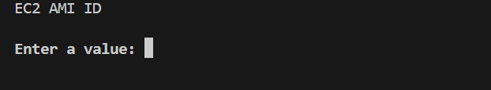

# Day 1 and 2
## Introduction and Basic concepts
### Introduction
**Infrastructure as Code (IaC):**\
Terraform is an open-source tool that enables developers to define and provision infrastructure using declarative configuration files.

**Multi-Cloud Support:**\
It supports multiple cloud providers, such as AWS, Azure, Google Cloud, and even on-premises solutions.

**Terraform Lifecycle**\
`init` - Inititalize terraform project. A **.terraform** folder with the plugins required eg. aws provider code, is created. It is - created when we run terraform init, and comes with the necessary plugins we need eg. aws provider code, synonymous to `node_modules` in node.\
`plan` - Shows a structure of the resources to be created\
`apply` - Enable us apply the changes that we defined, and actually provision them.

### Task 1: - Creating an EC2 instance
We specify the provider and the ami(minimum requirements)

```hcl
   provider "aws" {
     region = "eu-west-1"  # Set your desired AWS region
   }

   resource "aws_instance" "example" {
     ami           = "ami-ami-0084a47cc718c111a"  # Specify an appropriate AMI ID
     instance_type = "t2.micro"
   }
   ```

### Task 2: - Creating 2 EC2 instances in different regions
Note we need to specify an **alias**
```hcl
provider "aws" {
  region = "eu-central-1"
  alias = "eu-central-1"
}

provider "aws" {
  region = "eu-west-1"
  alias = "eu-west-1"
}

resource "aws_instance" "example1" {
  ami = "ami-ami-0084a47cc718c111a"
  instance_type = "t2.micro"
  provider = aws.eu-west-1 
}

resource "aws_instance" "example2" {
  ami = "ami-ami-0084a47cc718c111a"
  instance_type = "t2.micro"
  provider = aws.eu-central-1 
}
```

### Variables
Enables parameterization and vlaue sharing in terraform ocnfigurations, enabling reusability, and dynamic use.
#### Input variables
- **variable**:- declare the unput variable
- **description**:- description of the variable
- **type**:- provides the datatype supported by terraform string, number, list, map.
- **default**:- provides the default value of variable, *optional*.

#### Output variables
used to expose values from your module or configuration, making them available for use in other parts of your Terraform.

- **output**:- is used to declare an output variable named example_output.
- **description**: - provides a description of the output variable.
- **value** specifies the value that you want to expose as an output variable. Eg public IP of EC2 Instance.

### Task 3: - Creating EC2 instance specifying parameters using variables and output the public ip
```hcl

# Define an input variable for the EC2 instance type
variable "instance_type" {
  description = "EC2 instance type"
  type        = string
  default     = "t2.micro"
}

# Define an input variable for the EC2 instance AMI ID
variable "ami_id" {
  description = "EC2 AMI ID"
  type        = string
}

# Configure the AWS provider using the input variables
provider "aws" {
  region      = "us-europe-1"
}

# Create an EC2 instance using the input variables
resource "aws_instance" "example_instance" {
  ami           = var.ami_id
  instance_type = var.instance_type
}

# Define an output variable to expose the public IP address of the EC2 instance
output "public_ip" {
  description = "Public IP address of the EC2 instance"
  value       = aws_instance.example_instance.public_ip
}

```

If we run `terraform plan`, we get prompted to enter a value: which enables dynamic input.



We can however run `terraform plan -var "ami_id=ami-ami-0084a47cc718c111a"` in the command line to pass th value directly.

For more flexibility we can use tfvars.


### Terraform tfvars
`.tfvar` files are used to set specific input variables.
They offer:
- Separation of configuration from code and hence m,aking code easier to maintain and manage instead of hardcoding in `.tf` files.
- can include sensitive infomation such as API keys, credentials which can be kept being pushed in verison control.
- Reusbaility
- Collaboraion and avoiding conflicts, user can have their own .tf for configs.

By default, terraform looks for a file: `terraform.tfvars`.

If we rename them to something else like `example.tfvars`, we have to pass: `terraform apply -var-file example.tfvars`

**NOTE:** In the `.tf`, we **define** the variable then in the `.tfvars` we **assign** the variable

### ConditionalsExpressions
Suppose for our EC2 , for prod we a public access IP but in dev we have no public access, we can use conditionals.

Syntax: - `condition ? true : false`

Example:
```hcl
resource "aws_instance" "example" {
  count = var.create_instance ? 1 : 0

  ami           = "ami-XXXXXXXXXXXXXXXXX"
  instance_type = "t2.micro"
}

```
 The count attribute of the aws_instance resource uses a conditional expression. If the create_instance variable is true, it creates one EC2 instance. If create_instance is false, it creates zero instances, effectively skipping resource creation.

 Another use case: S3 bucket accessibility.

**terraform.tfstate:** - Tracking the state of of resource. Very important, as without it terraform cant tell the status of resources.

## Important commands picked on day 1 and 2
`terraform fmt`: - format the terraform script

`terraform apply --auto-approve`: - avoid needding to add yes for approval

`terraform state list `- list resources

`terraform state show aws_eip.one`. see details about a resource - further specific to resource

`terraform output` : show the outputs which are specified in output blocks

`terraform refresh` : can be used say in production we want to avoid running terraform output but want to view outputs.


